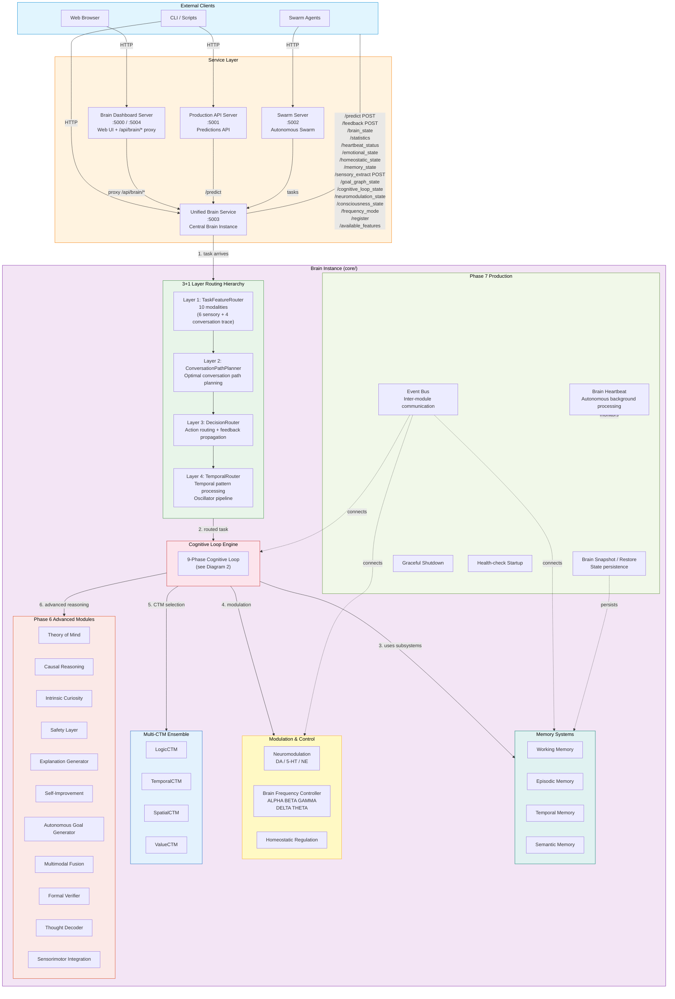
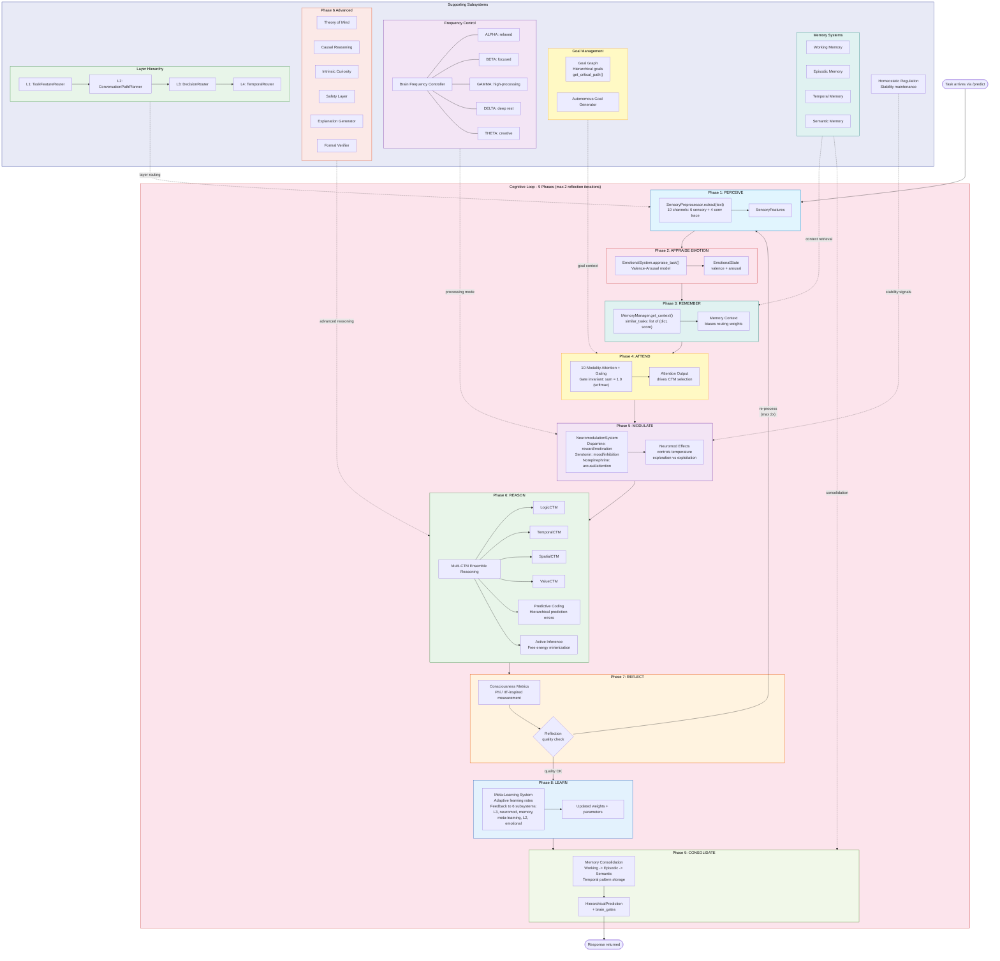

# Tahlamus Brain System - Architecture Diagrams

## 1. Service Architecture and Data Flow



---

## 2. Cognitive Loop with All Subsystems



---

## Quick Reference

### Data Flow Summary

```
Client Request
    |
    v
Service Layer (:5000/:5001/:5002/:5003)
    |
    v
Layer 1: TaskFeatureRouter (10 modalities)
    |
    v
Layer 2: ConversationPathPlanner
    |
    v
Layer 3: DecisionRouter
    |
    v
Layer 4: TemporalRouter (oscillator pipeline)
    |
    v
Cognitive Loop (9 phases, max 2 reflection iterations)
    |   perceive -> appraise_emotion -> remember -> attend
    |   -> modulate -> reason -> reflect -> learn -> consolidate
    |
    v
HierarchicalPrediction + brain_gates (sum = 1.0)
```

### Port Assignments

| Port | Service                  | Purpose                        |
|------|--------------------------|--------------------------------|
| 5000 | Brain Dashboard Server   | Web UI + API proxy             |
| 5001 | Production API Server    | Predictions API                |
| 5002 | Swarm Server             | Autonomous swarm coordination  |
| 5003 | Unified Brain Service    | Central brain instance         |
| 5004 | Dashboard (alternate)    | Secondary dashboard binding    |

### Gate Invariant

All `brain_gates` arrays MUST sum to 1.0 (enforced via softmax normalization). This applies to:
- `RoutingState.routing_weights` (can be ndarray or list)
- `WorkingMemoryEntry.brain_gates` (can be list or ndarray)
- `EpisodicMemoryEntry.brain_gates` (can be list or ndarray)

### Feedback Propagation Targets

The closed feedback loop in `production_planner.py` propagates to 6 systems:
1. Layer 3 (DecisionRouter)
2. Neuromodulation
3. Memory
4. Meta-Learning
5. Layer 2 (ConversationPathPlanner)
6. Emotional System
