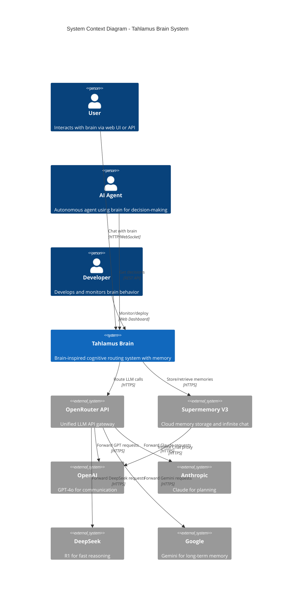
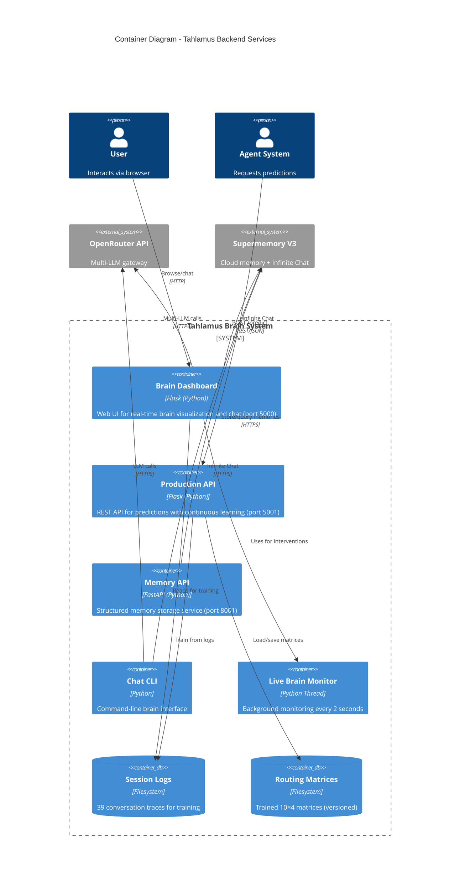
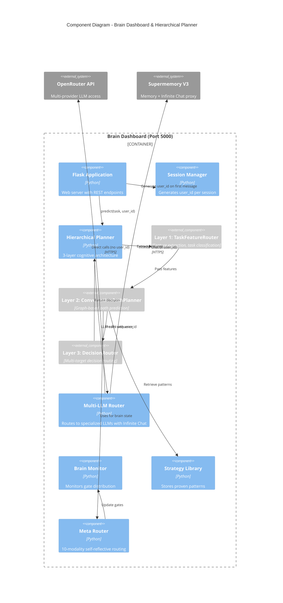
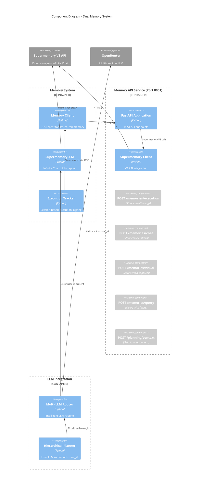
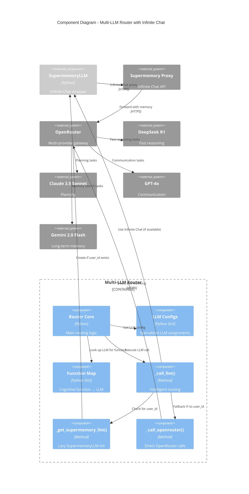

# Tahlamus C4 Architecture Diagrams

**Date:** October 16, 2025
**Status:** Complete system architecture documentation

This document provides C4 model diagrams for the Tahlamus brain-inspired cognitive routing system.

## Legend

- **Person**: External users/systems
- **System**: Software systems
- **Container**: Applications/services (processes, databases)
- **Component**: Code modules within containers

---

## Level 1: System Context Diagram

Shows Tahlamus in the context of users and external systems.



**Key Interactions:**
- Users chat with brain via web dashboard
- AI agents request decisions via production API
- All LLM calls routed through OpenRouter for unified access
- Memory stored in Supermemory with automatic infinite chat

---

## Level 2: Container Diagram

Shows the high-level technical building blocks (backend services).



**5 Backend Services:**
1. **Brain Dashboard** (port 5000) - Web UI + chat
2. **Production API** (port 5001) - Predictions + continuous learning
3. **Memory API** (port 8001) - Structured memory storage
4. **Chat CLI** - Command-line interface
5. **Live Brain Monitor** - Background monitoring thread (2s interval)

---

## Level 3a: Component Diagram - Hierarchical Planner

Shows components within the Brain Dashboard and Hierarchical Planner.



**3-Layer Architecture:**
- **Layer 1** (TaskFeatureRouter): Extracts task type, complexity, urgency
- **Layer 2** (ConversationPathPlanner): Predicts action sequence using trained graph
- **Layer 3** (DecisionRouter): Routes to actionable intervention via 10×4 matrix

**Key Flow:**
1. User sends message → Session Manager generates user_id
2. Hierarchical Planner processes task through 3 layers
3. Multi-LLM Router uses Infinite Chat (if user_id) or direct OpenRouter
4. Supermemory automatically injects relevant past conversations

---

## Level 3b: Component Diagram - Memory System

Shows the dual memory architecture components.



**Dual Architecture:**

**1. Structured Memory (Memory API)**
- **Execution Tracker** → formats session logs
- **Memory Client** → REST calls to Memory API
- **Memory API** → stores in Supermemory V3
- **Use case**: Agent execution logs, visual context, structured queries

**2. Automatic Memory (Infinite Chat)**
- **Multi-LLM Router** → checks for user_id
- **SupermemoryLLM** → Infinite Chat proxy (if user_id)
- **Supermemory** → automatic semantic memory injection
- **Use case**: LLM calls with conversation history

---

## Level 3c: Component Diagram - Multi-LLM Router

Shows how LLM routing works with Infinite Chat integration.



**Intelligent Routing Logic:**
```
route(function, prompt, user_id=None):
  1. Look up LLM for cognitive function
  2. Call _call_llm(model, prompt, user_id)

_call_llm(model, prompt, user_id):
  1. Check if user_id provided
  2. If user_id:
     - Get/create SupermemoryLLM client
     - Use Infinite Chat proxy (automatic memory!)
  3. If no user_id:
     - Call OpenRouter directly (no memory)
  4. Return response
```

**4 Specialized LLMs (DEV mode):**
- **DeepSeek R1** ($0.14/M) - Feature extraction, fast reasoning
- **Claude 3.5 Sonnet** ($3.00/M) - Planning, context tracking
- **GPT-4o** ($2.50/M) - Questions, communication
- **Gemini 2.0 Flash** ($0.075/M) - Long-term memory, 2M context

---

## Data Flow Diagrams

### Complete Request Flow

```
┌──────────────┐
│ User Message │
└──────┬───────┘
       │
       ▼
┌────────────────────────────────────┐
│ Brain Dashboard (port 5000)        │
│ 1. Generate session user_id        │
│ 2. Set user_id in routers          │
└────────┬───────────────────────────┘
         │
         ▼
┌────────────────────────────────────┐
│ Hierarchical Planner               │
│ Layer 1 → Layer 2 → Layer 3        │
└────────┬───────────────────────────┘
         │
         ├──→ Memory API (8001)
         │    Store execution logs
         │
         └──→ Multi-LLM Router
              ↓
              Check user_id?
              │
              ├─ YES → SupermemoryLLM
              │         ↓
              │    Supermemory Proxy
              │    1. Retrieve context
              │    2. Inject into LLM
              │    3. Store conversation
              │         ↓
              │    OpenAI/Claude/DeepSeek/Gemini
              │
              └─ NO → Direct OpenRouter
                       ↓
                  OpenAI/Claude/DeepSeek/Gemini
```

### Memory System Flow

```
┌─────────────────────────────────────────────────┐
│            STRUCTURED MEMORY                    │
└─────────────────────────────────────────────────┘

Agent Execution
      ↓
Execution Tracker (format session)
      ↓
Memory Client (REST)
      ↓
Memory API Service (port 8001)
      ↓
Supermemory V3 API
      ↓
Cloud Storage

Retrieval: Memory Client → Memory API → Supermemory → Query Results


┌─────────────────────────────────────────────────┐
│         AUTOMATIC SEMANTIC MEMORY               │
└─────────────────────────────────────────────────┘

LLM Call (with user_id)
      ↓
Multi-LLM Router
      ↓
SupermemoryLLM
      ↓
Supermemory Infinite Chat Proxy
      ├─ Retrieve relevant context (semantic search)
      ├─ Inject into prompt
      └─ Forward to LLM
            ↓
      LLM Response
            ↓
      Store conversation (automatic)
```

---

## Deployment View

### Production Environment

```
┌─────────────────────────────────────────────────────────────┐
│                    Local Machine (Windows)                   │
│                                                              │
│  ┌────────────────────────────────────────────────────────┐ │
│  │ Process 1: Brain Dashboard (port 5000)                 │ │
│  │ - Flask web server                                     │ │
│  │ - Real-time visualization                              │ │
│  │ - Chat interface with Infinite Chat                    │ │
│  └────────────────────────────────────────────────────────┘ │
│                                                              │
│  ┌────────────────────────────────────────────────────────┐ │
│  │ Process 2: Production API (port 5001)                  │ │
│  │ - REST API for predictions                             │ │
│  │ - Continuous learning (LR=0.005)                       │ │
│  │ - Matrix versioning                                    │ │
│  └────────────────────────────────────────────────────────┘ │
│                                                              │
│  ┌────────────────────────────────────────────────────────┐ │
│  │ Process 3: Memory API (port 8001)                      │ │
│  │ - FastAPI structured memory service                    │ │
│  │ - Multi-user support                                   │ │
│  └────────────────────────────────────────────────────────┘ │
│                                                              │
│  ┌────────────────────────────────────────────────────────┐ │
│  │ Process 4: Chat CLI                                    │ │
│  │ - Command-line interface                               │ │
│  └────────────────────────────────────────────────────────┘ │
│                                                              │
│  ┌────────────────────────────────────────────────────────┐ │
│  │ Thread: Live Brain Monitor (2s interval)               │ │
│  │ - Background monitoring                                │ │
│  │ - Intervention detection                               │ │
│  └────────────────────────────────────────────────────────┘ │
│                                                              │
│  ┌────────────────────────────────────────────────────────┐ │
│  │ Filesystem                                             │ │
│  │ - data/logs/sessions/ (39 conversation traces)         │ │
│  │ - production/trained_matrices/ (versioned matrices)    │ │
│  └────────────────────────────────────────────────────────┘ │
└─────────────────────────────────────────────────────────────┘

                         ↓ HTTPS ↓

┌─────────────────────────────────────────────────────────────┐
│                      External Services                       │
│                                                              │
│  ┌──────────────────┐    ┌──────────────────┐              │
│  │  OpenRouter      │    │  Supermemory V3  │              │
│  │  (Multi-LLM)     │    │  (Memory + Chat) │              │
│  └──────────────────┘    └──────────────────┘              │
│           │                        │                         │
│     ┌─────┴─────┐           ┌─────┴─────┐                  │
│     ↓     ↓     ↓           ↓           ↓                  │
│  DeepSeek Claude GPT-4o  OpenAI    Cloud Storage            │
│    R1    Sonnet         (proxy)                             │
│                                                              │
│  Gemini 2.0 Flash                                           │
└─────────────────────────────────────────────────────────────┘
```

**Ports:**
- **5000** - Brain Dashboard (web UI + chat)
- **5001** - Production API (predictions + learning)
- **8001** - Memory API (structured storage)

**Scheduled Tasks:**
- **Live Brain Monitor**: Every 2 seconds (background thread)
- All other services: Event-driven (HTTP request/response)

---

## Technology Stack

```
┌─────────────────────────────────────────────────┐
│              Application Layer                   │
├─────────────────────────────────────────────────┤
│ Flask (Brain Dashboard, Production API)         │
│ FastAPI (Memory API)                            │
│ Python 3.9+                                     │
└─────────────────────────────────────────────────┘

┌─────────────────────────────────────────────────┐
│               Core Libraries                     │
├─────────────────────────────────────────────────┤
│ NumPy (matrix operations, routing)              │
│ Requests (HTTP clients)                         │
│ NetworkX (conversation graphs)                  │
│ OpenAI SDK (LLM client)                         │
└─────────────────────────────────────────────────┘

┌─────────────────────────────────────────────────┐
│              External Services                   │
├─────────────────────────────────────────────────┤
│ OpenRouter API (multi-LLM gateway)              │
│ Supermemory V3 (memory + infinite chat)         │
│ DeepSeek R1, Claude 3.5, GPT-4o, Gemini 2.0    │
└─────────────────────────────────────────────────┘

┌─────────────────────────────────────────────────┐
│                 Storage                          │
├─────────────────────────────────────────────────┤
│ Filesystem (session logs, trained matrices)     │
│ Supermemory Cloud (structured memories)         │
└─────────────────────────────────────────────────┘
```

---

## Summary

**5 Backend Processes:**
1. Brain Dashboard (5000) - Web UI + chat with Infinite Chat
2. Production API (5001) - Predictions + continuous learning
3. Memory API (8001) - Structured memory storage
4. Chat CLI - Command-line interface
5. Live Brain Monitor - Background monitoring (2s intervals)

**6 LLM Integration Points:**
1. Multi-LLM Router - Routes to 4 specialized providers
2. Hierarchical Planner - Uses Multi-LLM Router with user_id
3. Supermemory Infinite Chat - Automatic semantic memory
4. Conversation Path Planner - Optional LLM enhancement
5. LLM Enhanced Inference - Available but not actively used
6. Brain Dashboard Chat - Frontend LLM interaction

**2 Memory Systems:**
1. Memory API (8001) - Structured storage (execution, chat, visual)
2. Infinite Chat - Automatic semantic memory injection

**1 Scheduled Task:**
- Live Brain Monitor (every 2 seconds)

**All other services:** Event-driven (request/response)

---

**Diagrams Status:** ✅ COMPLETE

**View diagrams:**
- Open this file in GitHub, GitLab, or any markdown viewer with Mermaid support
- Or use: https://mermaid.live/ (paste diagrams)
